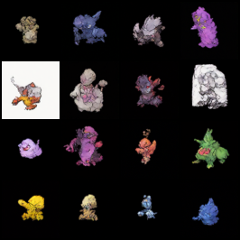

# Denoising Diffusion Probabilistic Model (DDPM) for Pokémon Generation

This repository contains a PyTorch implementation of a Denoising Diffusion Probabilistic Model (DDPM) built entirely from scratch. The model is trained to unconditionally generate $64 \times 64$ Pokémon sprites.

The implementation focuses on architectural transparency, providing a clean, vectorized realization of the original formulation by Ho et al. (2020).

## Results

*The image below showcases samples generated from pure Gaussian noise after 2000 epochs of training.*



## Architecture Details

The core of the generative process relies on a custom-built U-Net architecture integrated with a Markovian diffusion process.

### 1. U-Net Backbone
The noise-predicting network ($\epsilon_\theta$) is a U-Net featuring:
- **Sinusoidal Positional Embeddings**: Injected at every Residual Block to heavily condition the network on the current diffusion timestep $t$.
- **Residual Blocks**: Incorporating `GroupNorm(8)` and `SiLU` (Swish) activations for stable gradient flow.
- **Self-Attention Mechanisms**: A multi-head self-attention layer applied at the bottleneck ($16 \times 16$ spatial resolution) to capture global spatial dependencies across the feature maps.
- **Skip Connections**: Concatenated along the channel dimension during the upsampling pathway to recover fine-grained spatial details.

### 2. Diffusion Process
Implemented following standard DDPM mathematical formulations:
- **Forward Process**: Defines a linear variance schedule ($\beta$) ranging from $10^{-4}$ to $0.02$ across $T=1000$ timesteps.
- **Reverse Process**: Generative sampling is performed by iteratively denoising $x_T \sim \mathcal{N}(0, \mathbf{I})$ down to $x_0$, injecting Langevin noise $\sigma_t z$ at each step to prevent deterministic structural degradation.

## Training Configuration & Hyperparameters

The model was trained under the following configuration:

| Hyperparameter | Value | Description |
| :--- | :--- | :--- |
| **Image Resolution** | $64 \times 64$ | Spatially downsampled and normalized to $[-1, 1]$. |
| **Timesteps ($T$)** | 1000 | Number of discrete Markov steps. |
| **Epochs** | 2000 | Total passes over the entire dataset. |
| **Batch Size** | 64 | Chosen to maximize GPU memory utilization and gradient stability. |
| **Optimizer** | Adam | Adaptive moment estimation. |
| **Learning Rate** | $1 \times 10^{-4}$ | Constant learning rate without scheduling. |
| **Loss Function** | MSELoss | Mean Squared Error predicting $\epsilon$. |
| **Hardware** | NVIDIA RTX 4070 | 12 GB VRAM utilized during training. |

## Installation and Usage

### Prerequisites
Ensure you have Python 3.10+ installed. Install the required dependencies:
```bash
pip install -r requirements.txt
```

### 1. Training the Model
To initiate the training sequence, run:
```bash
python src/train.py
```
This will process the raw images, instantiate the U-Net, and output the model weights as `pokemon_unet.pth` upon completion.

### 2. Generating Samples
To generate new samples using the pre-trained weights, run:
```bash
python src/generate.py
```
This script initializes the reverse diffusion process and exports a grid of 16 generated samples to the `output/` directory.

## References
- Ho, J., Jain, A., & Abbeel, P. (2020). Denoising Diffusion Probabilistic Models. *Advances in Neural Information Processing Systems*, 33, 6840-6851.
