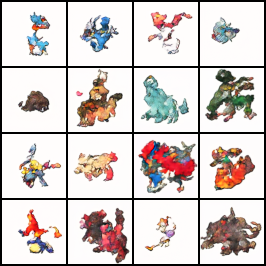

# Flow Matching for Pokémon Generation

[](https://pytorch.org/)
[](https://developer.nvidia.com/cuda-toolkit)
[](https://www.tensorflow.org/tensorboard)

This repository contains a state-of-the-art **Continuous Normalizing Flow (Flow Matching)** implementation built entirely from scratch in PyTorch. The model is engineered to unconditionally generate $64 \times 64$ Pokémon sprites by solving neural Ordinary Differential Equations (ODEs).

Unlike traditional discrete Markovian DDPMs, this implementation utilizes **v-prediction** (velocity prediction) in continuous time, resulting in vastly superior numerical stability, faster convergence, and higher-fidelity spatial details.

## Results

*The image below showcases samples generated by integrating the learned vector field using Heun's Method from pure Gaussian noise.*




## Mathematical Formulation (Flow Matching)

Traditional DDPMs predict the noise $\epsilon$ added to the image. This repository employs a modern Continuous Normalizing Flow framework:

1. **Target:** Predict the velocity vector field $v_t$ that transports a standard Gaussian distribution $\mathcal{N}(0, \mathbf{I})$ into the empirical data distribution.
2. **Velocity Field Objective:**
   $$ v = \frac{x_0 - z_t}{1.0 - t} $$
   Where $z_t$ is the noisy sample at continuous time $t \in [0, 1]$.
3. **Loss Function:**
   $$ \mathcal{L}_{MSE} = || \hat{v}_\theta(z_t, t) - v ||^2_2 $$
4. **Sampling (Heun's 2nd Order ODE Solver):**
   Instead of the discrete ancestral sampling of DDPMs, generation is performed by solving the ODE $dz = v_\theta(z, t)dt$ backwards from $t=1$ to $t=0$.

## Architecture & MLOps Pipeline

This repository is built following industry-standard MLOps practices for deep learning research.

### Generative Backbone
- **U-Net:** A highly optimized U-Net featuring `GroupNorm`, `SiLU` activations, and Multi-Head Self-Attention at the $16 \times 16$ bottleneck.
- **Time Conditioning:** Sinusoidal time embeddings are scaled to $[0, 1000]$ to match the high-frequency spectrum, injected at every residual block.

### MLOps Infrastructure

| Component | Implementation | Purpose |
| :--- | :--- | :--- |
| **CLI Arguments** | `argparse` | Eliminates hardcoded variables. Allows rapid hyperparameter tuning directly from the terminal without touching the source code. |
| **Experiment Tracking** | `TensorBoard` | Logs mathematically critical metrics in real-time (`runs/`), enabling visual monitoring of loss convergence. |
| **State Checkpointing** | `torch.save` | Periodically serializes the model (`unet`) and `optimizer` states to `checkpoints/`. Prevents catastrophic data loss during long 2000-epoch runs and allows resuming training. |
| **Dynamic Generation** | `torchvision` | Dynamically calculates optimal grid structures `int(ceil(sqrt(N)))` based on terminal inputs. |

## Installation and Usage

### Prerequisites
Ensure you have Python 3.10+ and a CUDA-capable GPU installed.
```bash
pip install -r requirements.txt
```

### 1. Training the Model (CLI)
Initiate the training sequence using the dynamic CLI parameters:
```bash
python src/train.py --epochs 2000 --batch_size 64 --lr 0.0001
```
*To resume a previous training session from a checkpoint:*
```bash
python src/train.py --resume checkpoints/epoch_200.pt
```

### 2. Live Metric Monitoring
In a separate terminal, launch TensorBoard to monitor the `Loss` landscape in real-time:
```bash
tensorboard --logdir runs
```

### 3. Generating Samples
Generate new samples using Heun's Method via the neural ODE solver:
```bash
python src/generate.py --samples 16 --steps 50 --output output/my_pokemons.png
```
- `--samples`: The number of images to generate (the script automatically creates a perfect square grid).
- `--steps`: The number of discrete integration steps for the ODE solver.

## References
- Lipman, Y., Chen, R. T., Ben-Hamu, H., Nickel, M., & Le, Matt. (2023). Flow Matching for Generative Modeling. *International Conference on Learning Representations (ICLR)*.
- Li, Z., & He, K. (2025). Back to Basics: Let Denoising Generative Models Denoise. *arXiv preprint*.
